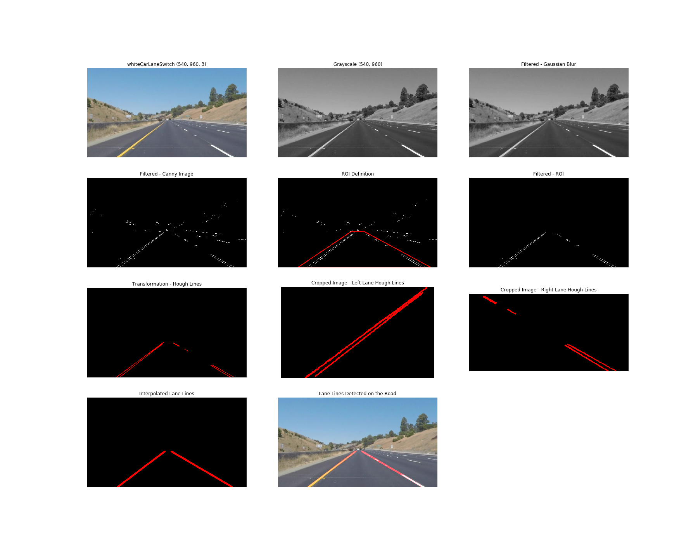

# **Finding Lane Lines on the Road** 

### 1. Describe your pipeline. As part of the description, explain how you modified the draw_lines() function.

**1.1 My pipeline consisted of the following steps :**
1. Grayscale Conversion
2. Gaussian Blur Filter
3. Canny Image Filter
4. ROI Definition
5. ROI Filter
6. Finiding Hough Lines
7. Interpolating and Plotting Lane Lines
8. Plotting Lane Lines on the Road


**1.2 Approach to Lane Line Interpolation**

In order to draw a single line on the left and right lanes, I defined a new function named: 
```python 
def extract_line(image):
    
    """
    INPUT: 
        A Blank image with Hough Lines plotted, cropped as left or right side. Cropping was also done to 
        reduce  computation time otherwise wasted in scanning region outside ROI.
    
    CODE LOGIC:
        - The X and Y coordinates of nonzero pixels are saved using `nonzero()`.
        - Using `np.polyfit()` the slope and intercept of a straight line that best fits these X and Y 
          coordinates found corresponding to Hough Lines plotted on a blank image.
        - Note: 
          The line was fitted in terms of Y because:
              * If the lines turn out to be vertical then for a given value of X there will be 
                infinite values of Y.
              * Hypothetically, if the lanes bend in a very small radius in a given frame, then for a 
                given value of X there can be two values of Y.
        - The slope and intercept were used to derive the equation of line.
        - The X coordinates were interpolated for Y values of 
            * 0 in the cropped image, which corresponds to the point of lane lines vanishing from sight 
              in the original frame
            * height-1 in the cropped image, which corresponds to the bottom of the frame.
            
    RETURNS:
        Line coordinates which can be passed onto the `draw_lines()` function for plotting the line on the 
        frame.
    """
   
    return (x_top, y_top, x_bottom, y_bottom)
```


---
### 2. An Example ouput from Each Stage of Pipeline:



--- 
### 3. Identify potential shortcomings with your current pipeline


I identified the following shortcomings:
1. Shadows and varying light conditions can adversely affect the Lane line detection.
2. White or high contrasting patches of any kind on the road between or around the lane lines
   can be detected as blobs which will act as an outlier during line fitting. This can at times 
   lead to absurd line equations.
3. The ROI defined at present best works for straight appearing roads. If the roads like in the challenge 
   video would curve significantly then unwanted region would be counted in while fitting the lines
   leading to too many outliers.
4. A linear equation is used at present for line fitting which will not work best for curves lines.

---
### 4. Suggest possible improvements to your pipeline


Some of the possible improvements to the current pipeline could be:
1. Using the HLS or HSV color space to filter out effect of shadows.
2. RGB color space can be used in addition to filter out lane lines as per their 
   distinct yellow and white color.
3. The outliers can be identified and eliminated before line fitting by comparing the deviation 
   in pixel positions with respect to the previous frames.
4. A quadratic equation can be used to plot curved lines.
